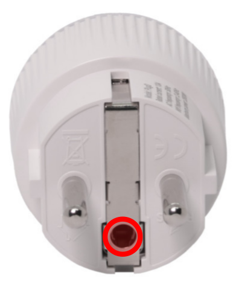
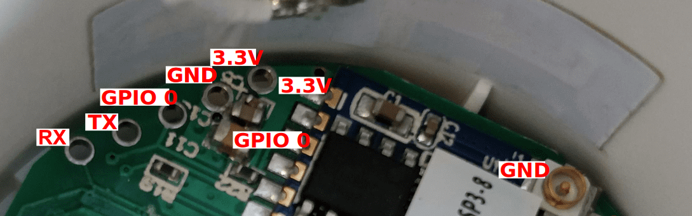

# Shelly Plug S

##Preparation/Flashing procedure
1. Preparation/Flashing procedure
2. Unscrew the screw situated on the backside of the Shelly Plug S, see <a href="#fig1">Fig. 1</a>.

	

	<em><strong>Fig. 1:</strong>Shelly Plug S - back view.</em>

3. Take off the power socket lid, see <a href="#fig2">Fig. 2</a>.

	

	<em><strong>Fig. 2:</strong>Shelly Plug S - front view.</em>

4. Connect the USB <-> UART converter to the socket PCB, according to <a href="#fig3">Fig. 3</a>. The GPIO O pin has to be grounded while applying the power to enter programming mode.

	

	<em><strong>Fig. 3:</strong>Shelly Plug S - PCB.</em>

5. In this phase, the device is ready to be flashed with the new firmware. After the Platform IO: Upload button press, see <a href="#fig4">Fig. 4</a>, the source code will be compiled and uploaded to the device.

	

	<em><strong>Fig. 4:</strong>Platform IO - Upload.</em>

6. After reboot, the device starts the connection procedure according to the MQTT2GO standard, see the [link](https://mqtt2go.github.io/).
