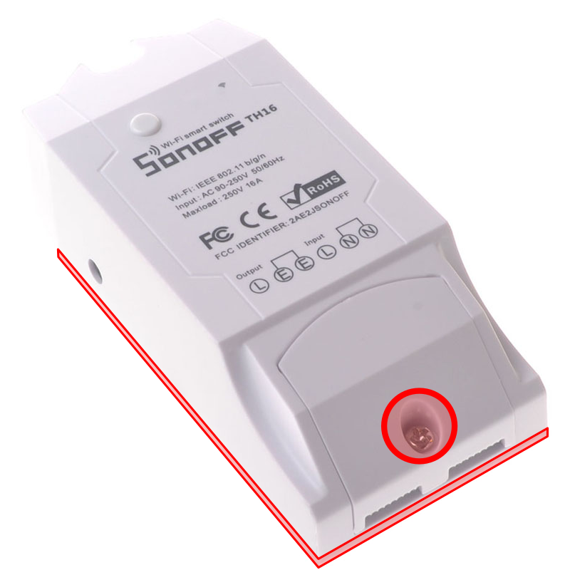
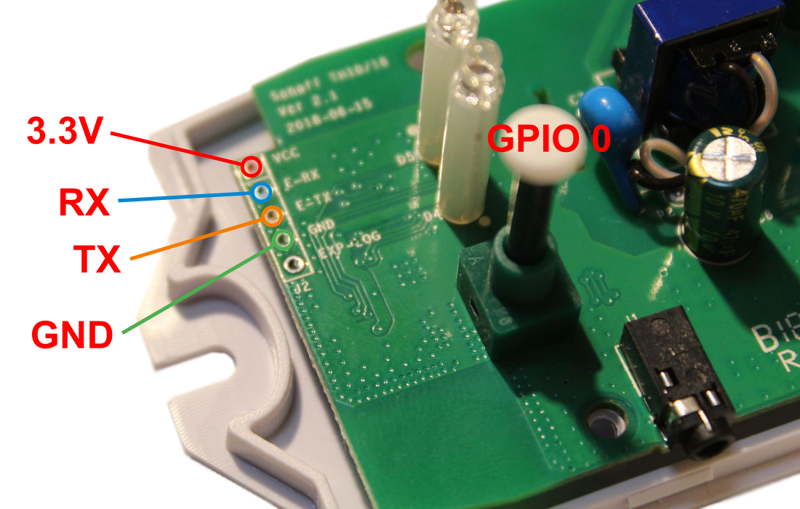

# Sonoff TH 16 Multi Sensor

## Preparation/Flashing procedure

1. Remove the cover of the Sonoff TH 16 multi sensor, see <a href="#fig1">Fig. 1</a>.

	

	<em><strong>Fig. 1:</strong>Sonoff TH16.</em>

2. Connect the USB <-> UART converter to the power meter PCB, according to <a href="#fig2">Fig. 2</a>. The GPIO 0 pin has to be grounded while applying the power to enter programming mode. To do so, press the button while plugging the device.

	

	<em><strong>Fig. 2:</strong>Sonoff TH16 - PCB.</em>

3. In this phase, the device is ready to be flashed with the new firmware. After the Platform IO: Upload button press, see <a href="#fig3">Fig. 3</a>, the source code will be compiled and uploaded to the device.

	

	<em><strong>Fig. 3:</strong>Platform IO - Upload.</em>

4. After reboot, the device starts the connection procedure according to the MQTT2GO standard, see the [link](https://mqtt2go.github.io/).

## Required External Dependencies

* PubSubClient [link](https://github.com/knolleary/pubsubclient),
* ArduinoJson [link](https://github.com/bblanchon/ArduinoJson),
* TroykaDHT [link](https://github.com/amperka/TroykaDHT).

## Configurable Parameters

* _CLIENT_ID_ – represents the Device ID of MQTT2GO standard,
* _ACTIVATION_CODE_ – represents the Activation Code of MQTT2GO standard,
* _fingerprint_ – hashed fingerprint of the initial CA certificate,
* _REQ_SSID_ – SSID of the guest Wi-Fi utilized in adding procedure [link](https://mqtt2go.github.io/add-wifi.html).

